# Portal and Dashboard User Guide

## Introduction

This document describes the features and basic navigation of the CFDE portal. If you are looking for documentation on using the submission system specifically, [that documentation is here](https://github.com/nih-cfde/published-documentation/wiki).

### Common Fund Data Ecosystem (CFDE)

The NIH Common Fund (CF) has funded a wide variety of data types and studies that are of interest to clinical and biomedical researchers, however, those datasets are hosted on an equally large number of websites, with varying query systems. The Common Fund Data Ecosystem (CFDE) Portal is a unified system for searching across the entire CF portfolio in a single search and is the first step in addressing the goal of making CF data more Find-able, Accessible, Interoperable and Reusable (FAIR). The wide range of data types, models, and formats used by Common Fund Programs are being harmonized using well-defined metadata, and common controlled vocabularies using the Crosscut Metadata Model.

The CFDE Search Portal uses the Crosscut Metadata Model (C2M2), a flexible metadata standard for describing experimental resources in biomedicine and related fields. This portal supports faceted searches of metadata concepts such as anatomical location, species, and assay type, across a wide variety of datasets using a controlled vocabulary (we do not currently support protected metadata). This allows researchers to find a wide variety of data that would otherwise need to be searched individually, using varying nomenclatures. The portal only accepts C2M2 data packages from Common Fund Programs.

The CFDE is an effort to identify and solve issues that inhibit data access and reuse across NIH CF programs. The goal of the CFDE is for Common Fund data to be more usable and useful both within a single program and among datasets from multiple programs. By connecting the datasets and making them more accessible, the CFDE is intended to enable novel scientific research that was not possible before, including hypothesis generation, discovery, and validation.

The specific goals of the CFDE are to:

*   Increase usability – enable the uptake, reuse, and creation of Common Fund (CF) data and tools.
*   Preserve data – support the storage, sharing, and sustainability of CF datasets.
*   Provide training – maximize scientists’ ability to use CF data and other resources.

### Purpose of this Document

The CFDE website includes two modules to ensure the specific goals are met and users can find data—the [portal](https://app.nih-cfde.org/) and the [dashboard](https://app.nih-cfde.org/udashboard.html). This document describes those modules in detail. The goals of both the portal and the dashboard are to establish FAIR data production by:

*   **F**indable – Providing rich metadata using an entity-relationship model to express relationships between diverse data elements.
*   **A**ccessible – Offering rich access control and access to metadata via standard HTTP web service interfaces.
*   **I**nteroperable – Integrating with standardized terms defined by collaborators, consortium, and communities.
*   **R**eusable – Supporting dynamic model evolution so the presented data accurately represents the current structure and state of knowledge within an investigation.

To support these principals, the dashboard and data browser within the portal emphasize well-defined metadata and data models, use controlled vocabularies and ontologies, allow others to reproduce experiments, etc.

### Login

Some features are available without logging in, but to save queries and access your personalized dashboard, you must log in. 

---

NOTE: To access your personalized dashboard, you must be added to the NIH CFDE Portal Members group.

---

To log into the portal and dashboard:

1. Click **Log In** in the upper-right of the page. The Login page displays.

    

2. Search for your organization using the drop-down and sign in using Google, ORCID, or NIH Researcher Auth Service (RAS). Logging in using RAS with your NIH credentials is helpful if you want to view the dbGaP Study ID permissions in the [File data browser](#browse-by-file).

    a. If you do not see your organization in the drop-down, then click **Sign in with ORCID ID** to create a Globus account. A warning message displays.

    

    b. Click **Allow**.
    
    c. Enter your information and click **Login**.

3. If this is your first time logging in after November 1, 2021, the Sign up for Personalized Dashboard Features page displays.

    

4. Click **Sign Up** to be added to the NIH CFDE Portal Members group so you can view the personalized dashboard features. If you click Proceed before being added to the group, you will be returned to the portal Home page without being logged in. The Join Group page displays:
    
    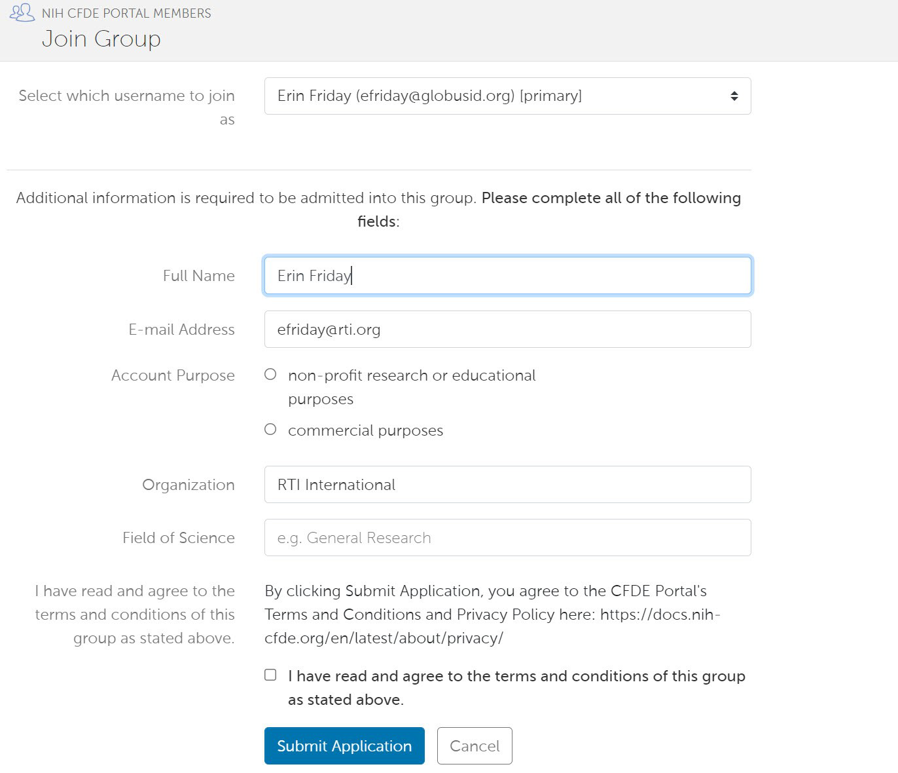

5. Enter your information and click **Submit Application**.
6. Return to the Sign up for Personalized Dashboard Features page (in Step 3 above) and click **Proceed**. You will be logged in and see your personalized dashboard.

### View Your Profile

Select your name in the upper-right after logging in, click the down arrow, and select **My Profile**. Your user profile information displays along with the saved searches and favorites from your personalized dashboard. Click “Add Record” in a gray menu bar to manually add a favorite.

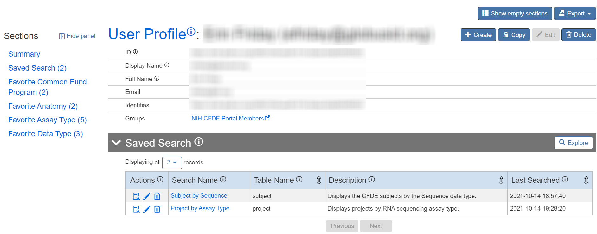

### View and Create Your Personal Collections
Personal Collections are customized collections of files. From this page, you can customize your personal collections, view the files, and export them.

NOTE: A file must have a defined persistent ID before it can be added to your personal collection.

To view and create your personal collection:
1. Select your name in the upper-right after logging in, click the down arrow, and select **Personal Collections**. The Personal Collection page displays.

    

2. Use the View Details, Edit, and Delete icons in the Actions column to view and modify an existing collection.
3. Click **Create** to create a new collection. The Create New Personal Collection page displays.

    

4. Enter the **Name** and the **Description** of the collection.
5. Click **Save**. A summary of the new collection displays.
6. Click **Show Empty Sections** to add records to the collection.

    

7. In the File in Collection section, click **Add Record**.

    

8. Select the checkboxes next to the files to add to your collection. Use the filter panel and search box in the upper-left to locate specific files. 
9. Click **Save**. The files are now associated with your personal collection and the collection displays as a separate line item on the Personal Collection page.
10. If necessary, select **Export > File Manifest** in the upper-right of the collection (you can also access a collection by clicking the View Details icon on the Personal Collection page) to export the file details in CSV format. The CSV export consists of metadata where the Persistent ID is a path to where the file is hosted/stored. An NCPI (NIH Cloud Platform Interoperability) manifest file includes file details regarding the NCPI, which is an effort by the NIH to convene around interoperation for cloud workbenches.

To add a file to a collection from the Data Browser:
1. Select **Data Browser > File** from the main menu.
2. Search for the appropriate file. Ensure the “Has Persistent ID” facet is set to “True” since files in personal collections must have a defined Persistent ID.
3. Click **View Details** next to the appropriate file. The file details display.

    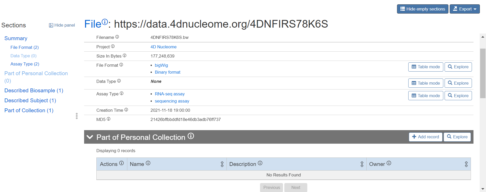

4. In the Part of Personal Collection section, click **Add Record**. The Add Personal Collection to File page displays.

    
    
5. Select the checkbox next to the appropriate collection to which to add the file. Click **Save**. The file is added to the personal collection and the details on the Personal Collection page updates automatically.

## Portal

The CFDE portal is a hub for searching the CFDE data across all programs. The main page of the portal (shown below) is meant for high-level decision-making, whereas the repository (or “data browser”) allows users such as clinical researchers, bioinformatics power users, and NIH program officers to search for CFDE data.

From the portal, you can:

*  View and export a dashboard bar chart.
*  Explore the repository of Common Fund data.
*  Access the full dashboard with additional summary charts.
*  Read documentation about the C2M2 and FAIR Cookbook.
*  See the latest news regarding the CFDE.

### Access the Portal

Access the portal directly by using this link: [https://app.nih-cfde.org/](https://app.nih-cfde.org/).

### Filter the Chart

The portal chart is an interactive graphic that renders automatically when different criteria are selected from the X-axis, Y-axis, and Stack By drop-downs. For example, the chart below shows the number of files by assay for each data type.

To filter the portal chart:

1. Select an **X-axis** value from the drop-down. Options include:
    - Anatomy
    - Assay
    - CF Program
    - Data Type
    - Disease
    - Ethnicity
    - Race
    - Sex
    - Species

    The horizontal axis of the bar chart updates automatically with the option selected.

2. Select a **Y-axis** value from the drop-down. Options include:
    *   Data Volume
    *   File Count
    *   Sample Count
    *   Subject Count

    The vertical axis of the bar chart updates automatically with the option selected.

3. Select a **Stack By** value from the drop-down. Options include:
    - Anatomy
    - Assay
    - CF Program
    - Data Type
    - Disease
    - Ethnicity
    - Race
    - Sex
    - Species

    The bars are stacked/sorted automatically with the option selected and the color-coded key updates with the appropriate categories.

---

NOTE: The same X-axis option cannot be selected for the Stacked By option, so the corresponding option in the Stacked By drop-down will be disabled if it is already selected in the X-axis drop-down.

---

### Download the Chart

The Download icon () displays next to each chart to export the data as a PNG, SVG, or CSV file. The PNG and SVG exports are image files of the chart, whereas the CSV export is a spreadsheet of the data.

### Explore the Repository

The CFDE repository, referred to as the “data browser,” provides views of the data based on the underlying data model and annotations. Using the data browser, you can:

*   Search, explore, and browse collections of data
*   Navigate from one data record to the next by following their relationships
*   Explore and export data collections
*   Share data with other users and cite the data for use in publications

The portal includes multiple ways to access the repository so you can view the data differently. For example, under the Data Browser menu, you can select “Collection” to see the entire CFDE data collection or select “Biosample” to see the data automatically pre-filtered by biosample. The data that displays and the Refine Search options differ based on the option selected.

The repository can be accessed in the following ways from the portal:

*   Select **Data Browser > Collection** from the main menu bar. See the [Browse All Collections](#browse-all-collections) section below for
more information.
*   Click an icon under Start your Search to display a pre-filtered repository by one of the following features (NOTE: These options also display under the Data Browser drop-down in the main menu bar):
    *   Anatomy – See the [Browse by Vocabulary](#browse-by-vocabulary) section below for more information.
    *   Assay – See the [Browse by Vocabulary](#browse-by-vocabulary) section below for more information.
    *   File – See the [Browse by File](#browse-by-file) section below for more information.
    *   Biosample – See the [Browse by Biosample](#browse-by-biosample) section below for more information.
    *   Subject – See the [Browse by Subject](#browse-by-subject) section below for more information.
*   Select **Data Browser > Project** from the main menu bar. See the [Browse by Project](#browse-by-project) section below for more information.
*   Select **Data Browser > Primary DCC Contact** from the main menu bar. See the [Browse by Primary DCC Contact](#browse-by-primary-DCC-contact) section below for more information.
*   Select **Data Browser > Vocabulary** from the main menu bar and select an item from the list. See the [Browse by Vocabulary](#browse-by-vocabulary) section below for more information.
*   Select **Data Browser > ID Namespace** from the main menu bar. See the [Browse by ID Namespace](#browse-by-id-namespace) section below for more information.

### Browse All Collections

To search by all collections:

1. Select **Data Browser > Collection** from the main menu bar.
  
    The entire CFDE data collection displays in the data browser.
    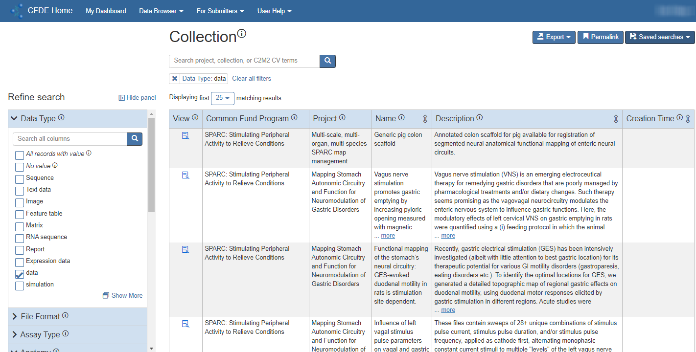

2. The data browser includes the following columns in the results table:
    *   View – Click the icon next to the appropriate record to view more information about the record. See the [View Details](#view-details) section for more information.
    *   Common Fund Program – The Common Fund program that defines the collection.
    *   Project – The project that defines the collection.
    *   Disease - The disease studied in the collection.
    *   Phenotype - The phenotype studied in the collection.
    *   Name – A short user-friendly label for the collection.
    *   Description – A user-friendly description of the collection.
    *   Creation Time – The date and time the collection was created.
3. The results can be filtered using the Refine Search filter panel. See the [Refine Search Results](#refine-search-results) section for more information. The panel includes the following facets by which you can filter the results:
    *   Data Type
    *   File Format
    *   Assay Type
    *   Anatomy
    *   Taxonomy
    *   Disease
    *   Compound
    *   Protein
    *   Gene
    *   Phenotype
    *   Common Fund Program
    *   Project
    *   Subject Granularity
    *   Has Time Series Data
    *   Collection Creation Time

### Browse by File

To search by file:

1. Select one of the following options:
    *   The **Data Browser > File** option in the main menu bar.
    *   The **File** link under View Data By in the Start your Search section on the main portal page.

    The data browser displays the CFDE data and filters related to files.
    

2. The data browser includes the following columns in the results table:
    *   View – Click the icon next to the appropriate record to view more information about the record. See the
[View Details](#view-details) section for more information.
    *   Common Fund Program – The Common Fund program that defines the file.
    *   Project – The project attributed as the source of the file.
    *   dbGaP Study ID - The RAS permissions for files are indicated by a green circle (user has access to the file), a yellow circle (user does not have access to the file), or a gray circle (user access to the file cannot be determined).
    *   File Format – The content format of the file.
    *   Data Type – The type of data represented by the file.
    *   Assay Type – The assay type represented by the file.
    *   Analysis Type - The analysis type used to generate the file.
    *   Size in Bytes – The size of the file in bytes.
    *   Filename – The name of the file excluding prepended PATH information.
    *   Persistent ID – A persistent, resolvable URI generated by a DCC and attached to the file.
    *   Creation Time – The date and time the file was created.
3. The results can be filtered using the Refine Search filter panel. See the [Refine Search Results](#refine-search-results) section for more information. The panel includes the following facets by which you can filter the results:
    *   Data Type
    *   File Format
    *   Assay Type
    *   Analysis Type
    *   Anatomy
    *   Subject Taxonomy
    *   Disease
    *   Phenotype
    *   Compound
    *   Gene
    *   Age at Sampling
    *   Sex
    *   Race
    *   Ethnicity
    *   Age at Enrollment
    *   dbGaP Study ID
    *   Common Fund Program
    *   Project
    *   Subject Granularity
    *   File Creation Time
    *   Size in Bytes
    *   Has Persistent ID
    *   Is Bundle
    *   Uncompressed Size in Bytes
    *   Compression Format

### Browse by Biosample

To search by biosample:

1. Select one of the following options:
    *   The **Data Browser > Biosample** option in the main menu bar.
    *   The **Biosample** link under View Data By in the Start your Search section on the main portal page.

    The data browser displays the CFDE data and filters related to biosamples.
    

2. The data browser includes the following columns in the results table:
    *   View – Click the icon next to the appropriate record to view more information about the record. See the
[View Details](#view-details) section for more information.
    *   Common Fund Program – The Common Fund program that defines the biosample.
    *   Local ID – The unique biosample ID within the ID Namespace.
    *   Persistent ID – A persistent, resolvable URI generated by a DCC and attached to the file.
    *   Creation Time – The date and time the biosample was created.
    *   Age at Sampling – The subject's age, in years, when the biosample was taken.
3. The results can be filtered using the Refine Search filter panel. See the
[Refine Search Results](#refine_search_results) section for more information. The panel includes the following facets by which you can filter the results:
    *   Assay Type
    *   Anatomy
    *   Subject Taxonomy
    *   Disease
    *   Phenotype
    *   Compound
    *   Gene
    *   Common Fund Program
    *   Project
    *   Creation Time
    *   Age at Sampling

### Browse by Subject

To search by subject:

1. Select one of the following options:
    *   The **Data Browser > Subject** option in the main menu bar.
    *   The **Subject** link under View Data By in the Start your Search section on the main portal page.

    The data browser displays the CFDE data and filters related to subjects.
    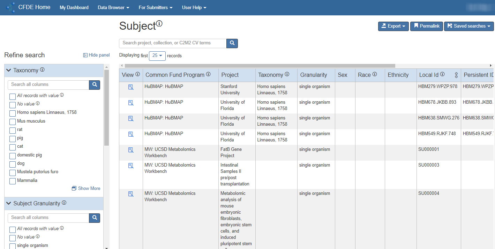

2. The data browser includes the following columns in the results table:
    *   View – Click the icon next to the appropriate record to view more information about the record. See the
[View Details](#view-details) section for more information.
    *   Common Fund Program – The Common Fund program that defines the subject.
    *   Taxonomy – The taxonomy concepts that characterize the subject.
    *   Race – The race characterizing the subject.
    *   Local ID – The unique subject ID within the ID Namespace.
    *   Persistent ID – A persistent, resolvable URI generated by a DCC and attached to the file.
    *   Creation Time – The date and time the subject record was created.
    *   Age at Enrollment – The age, in years, of the subject when they were first enrolled in the project in which they were studied. 
3. The results can be filtered using the Refine Search filter panel. See the
[Refine Search Results](#refine-search-results) section for more information. The panel includes the following facets by which you can filter the results:
    *   Taxonomy
    *   Subject Granularity
    *   Sex
    *   Race
    *   Ethnicity
    *   Disease
    *   Phenotype
    *   Compound
    *   Gene
    *   Taxonomic Role
    *   Anatomy
    *   Assay Type
    *   Data Type
    *   File Format
    *   Common Fund Program
    *   Project
    *   Creation Time
    *   Age at Enrollment

### Browse by Project

To search by project:

1. Select **Browse All Data > Project** from the main menu bar. 
The data browser displays the CFDE data and filters related to projects. 
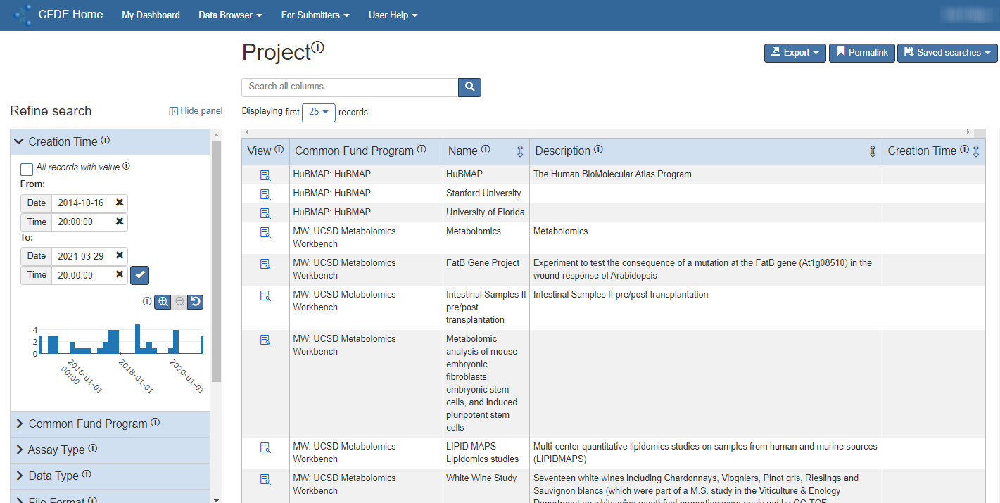

2. The data browser includes the following columns in the results table:
    *   View – Click the icon next to the appropriate record to view more information about the record. See the
[View Details](#view-details) section for more information.
    *   Common Fund Program – The Common Fund program that defines the project.
    *   Name – A short user-friendly label for the project.
    *   Description – A user-friendly description of the project.
    *   Creation Time – The date and time the project was created.
3. The results can be filtered using the Refine Search filter panel. See the
[Refine Search Results](#refine-search-results) section for more information. The panel includes the following facets by which you can filter the results:
    *   Creation Time
    *   Common Fund Program
    *   Assay Type
    *   Data Type
    *   File Format
    *   Anatomy (slim)
    *   Anatomy
    *   Subject Taxonomy
    *   Disease
    *   Super-Project
    *   Sub-Project

### Browse by Common Fund Program

To search by primary DCC contact:

1. Select **Data Browser > Common Fund Program** from the main menu bar. The data browser displays the CFDE data and filters related to the Common Fund Programs.
    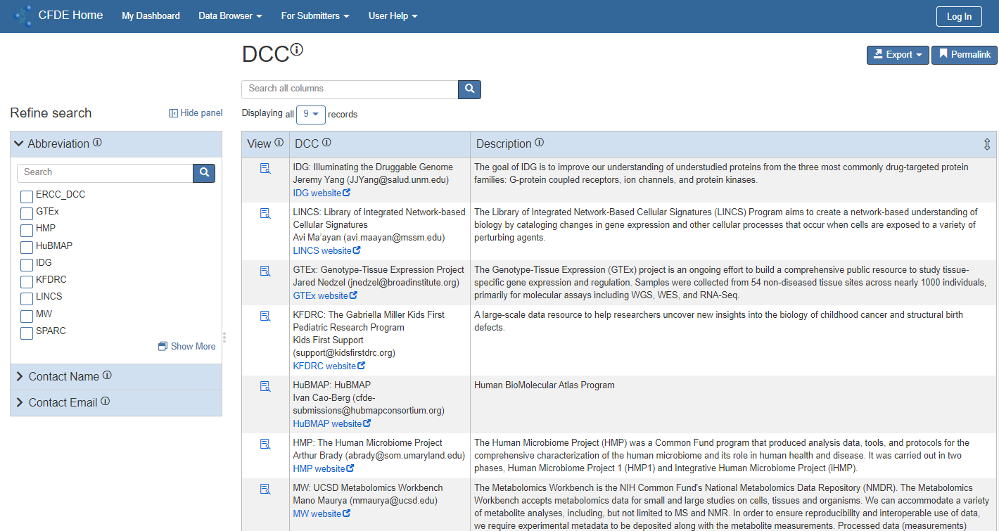
2. The data browser includes the following columns in the results table:
    *   View – Click the icon next to the appropriate record to view more information about the record. See the
[View Details](#view-details) section for more information.
    *   DCC – Contact information about the Data Collection Center (DCC).
    *   Description – A user-friendly description of the DCC.
3. The results can be filtered using the Refine Search filter panel. See the
[Refine Search Results](#refine-search-results) section for more information. The panel includes the following facets by which you can filter the results:
    *   Abbreviation
    *   Contact Name
    *   Contact Email

### Browse by Vocabulary

To search by vocabulary:

1. Select **Data Browser > Vocabulary** from the main menu bar.
2. Select an item from the list:
    *   Analysis Type
    *   Anatomy
    *   Assay Type
    *   Compound
    *   Data Type
    *   dbGaP Study ID
    *   Disease
    *   Ethnicity
    *   File Format
    *   Gene
    *   MIME Type
    *   NCBI Taxonomy
    *   Phenotype
    *   Protein
    *   Race
    *   Sex
    *   Subject Granularity
    *   Subject Role
    *   Substance

    The data browser displays the CFDE data and filters related to the vocabulary term.

3. The columns vary based on the vocabulary term selected.
4. The available filters in the Refine Search panel vary based on the vocabulary term selected. See the
[Refine Search Results](#refine-search-results) section for more information on how to filter the results.

### Browse by ID Namespace

To search by ID namespace:

1. Select **Data Browser > ID Namespace** from the main menu bar.

    The data browser displays the CFDE data and filters related to the ID namespace data contributors.
    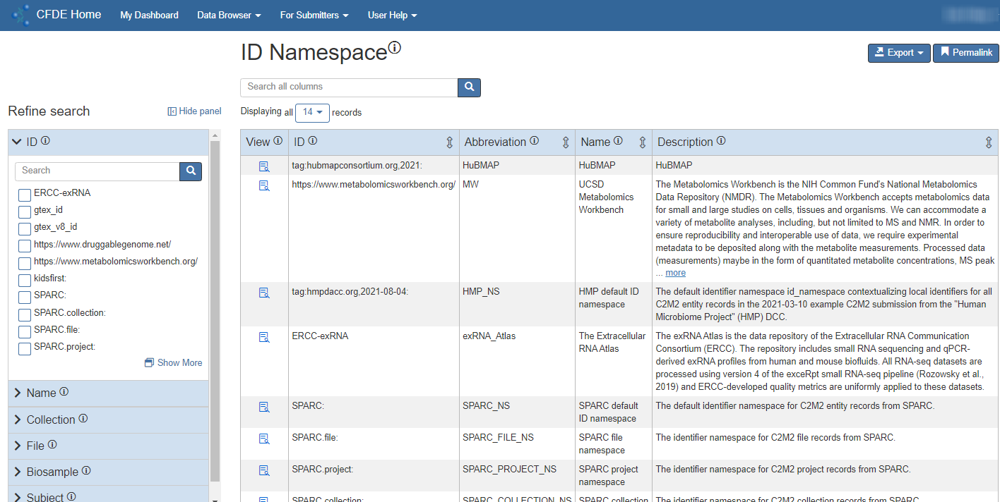

2. The data browser includes the following columns in the results table:

    *   View – Click the icon next to the appropriate record to view more information about the record. See the
[View Details](#view-details) section for more information.
    *   ID – The unique ID within the ID Namespace.
    *   Abbreviation – A short label for the ID Namespace.
    *   Name – A short user-friendly label for the ID Namespace.
    *   Description – A user-friendly description of the ID Namespace.

3. The results can be filtered using the Refine Search filter panel. See the
[Refine Search Results](#refine-search-results) section for more information. The panel includes the following facets by which you can filter the results:
    *   ID
    *   Name
    *   Collection
    *   File
    *   Biosample
    *   Subject

### View Details

Click the icon in the View column (
) next to the appropriate record in the results table to view more information about the record, such as the metadata and links to the data files for that record. The options available on the View Details page vary based on the record selected, but this section of the document will use the screenshot below as an example.

The metadata displays in the summary section at the top of the page. In the example above, the metadata includes:

*   ID Namespace – The hyperlink will display a View Details page for the Genotype-Tissue Expression ID Namespace.
*   ID – The unique ID within the ID Namespace.
*   Persistent ID – An identifier that provides a single view of an individual across numerous devices (desktop, mobile, in-app, etc.) without duplication.
*   Defined by Project – The hyperlink will display the Genotype-Tissue Expression (GTEx) project in a separate data browser.
    *   Click **Table Mode** to display the project in a table with additional information.    
    *   Click **Explore** to open the project in a separate data browser.

*  Name – A short user-friendly label for the ID Namespace.
*  Description – A user-friendly description of the ID Namespace.
*  Creation Time – The date and time the project was created.

The anatomy, compound, disease, gene, and protein pages are now annotated with images, interactive widgets, aliases, associations, and links to databases. For example, the View Details page for an Anatomy file:
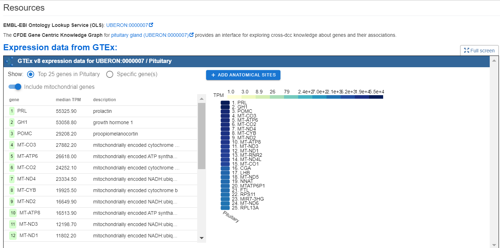

The Sections panel on the left displays links to the contents of the View Details page (similar to a Table of Contents) and the counts for each section. Click one of the links to jump to that section of the View Details page. You can also scroll down the page to view the sections instead of using these links.

Click **Explore** in the gray section header to open the section in a separate data browser, where you can use the Refine Search filter panel to refine your search.

Within each data file, you can click the **View** icon to view additional information about the record.

The buttons in the upper-right of the page include:

*   Show/Hide empty sections - Toggles the empty sections that display on this page.
*   Export – See the
[Export Search Results](#explore-search-results) section for more information.

### Refine Search Results

To use the facets to refine your search results:

1. Click the down arrow next to the appropriate facet to display the related attributes by which you can filter the results.    
    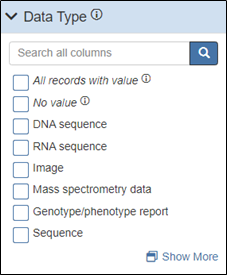

2. Within a facet, you can perform any of the following to filter the results:
    *   Select the appropriate attribute checkbox(es).
    *   Use the Search box to search for attributes only within that facet.
    *   Click **Show More** to display additional information about the attributes.
    

3. The time-related facets (Collection Creation Time, File Creation Time, and Biosample Creation Time) and the Size in Bytes facet function differently. To filter on a time-related facet, perform one of the following:
    *   Enter the **From** and **To** dates and times. Click the blue checkmark to filter the results in the main data browser.
    *   Use the interactive histogram to find the appropriate time period. Click and drag anywhere in the graph to zoom into a smaller subset of data. The From and To dates update automatically as you use the histogram, but you must select the blue checkmark to filter the results in the main data browser.

### Sort and View Search Results

The data browser search results can be sorted and viewed using the following functions:

*   The results table can be sorted by column header using the arrow icon (
).
*   View a different amount of results on one page by selecting a different option for the **Displaying first number of records** drop-down.

*   Use the **Search All Columns** search box at the top of the results table to search for records within the table.

*   View additional results by clicking the **Next** button at the bottom of the table.
*   Click the **X** next to the filter to remove the one filter from the search results.

*   Click **Clear All Filters** to remove all filters from the search results.

### Export Search Results

Search results can be exported from the main data browser and from the View Details page. To export the search results:

1. Click the **Export** button.

    

2. Select **CSV** or **BAG**. The options that display will depend on which page you are on:
    *   CSV – Opens a .csv file in Excel that includes the metadata displayed in the search results in tabular format. All of the search results display in the file; not just the first page of results. The columns of the CSV file include:
        *   RID - The internal Record ID, which could be considered the Primary Key.
        *   RCT - The timestamp representing the Record Creation Time.
        *   RMT - The timestamp representing the Record Modified Time.
        *   RCB - The Record Created By, which is the GlobusAuth identity string (GUID) representing the creator of the record.
        *   RMB - The Record Modified By, which is the GlobusAuth identity string (GUID) representing the user who last modified the record.
        *   Id_namespace - A C2M2 column that represents the unique DCC namespace identifier assigned by the CFDE to the DCC.
    *   BAG – This option is only available for the View Details page. Downloads the data to a .bag file used for storing ROS message data. Use this option if you want to download large files or if a particular dataset includes many files.

3. For File exports, an additional export option for **NCPI File Manifest** is available. This option exports the BDBAG data plus the actual files associated with the record pages. The file includes the DRS_URI that includes a link to the file information. Note that the file must have a Persistent ID to view the DRS_URI.

### Save Searches

On any data browser page, you can save searches and easily return to them later through your [personalized dashboard](#navigate-the-personalized-dashboard).

To save a search:
1. Select **Saved Searches > Save current search criteria** from the upper-right of the page. The Save Current Search Criteria pop-up displays.

    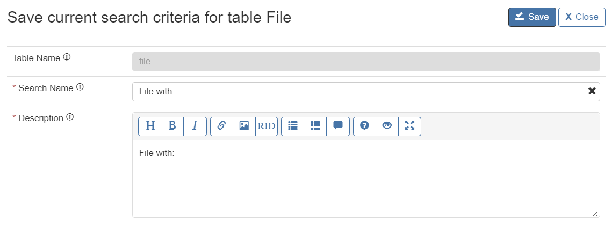
    
3. Enter a **Query Name** for your saved search. This displays as the Search Name on your personalized dashboard.
4. Enter a **Description** for your saved search. This displays when you hover over the Search Name on your personalized dashboard.
5. Click **Save**.

To view saved search criteria:
1. Select **Saved Searches > Show saved search criteria** from the upper-right of the page. The Saved Search Criteria for Table pop-up displays the saved searches related only to that repository.

    

If no saved searches exist for that repository, then this pop-up will not display any results.

### Add Favorites
On any data browser page, you can save favorites for vocabulary items and easily return to them later through your [personalized dashboard](#navigate-the-personalized-dashboard). Currently, the favorites that display on your dashboard are items under the CF Programs, Anatomy, Assay, Disease, Taxonomy, Data Type, File Format, Gene, and Compound facets in the Refine Search filter panel.

To add a favorite:
1. Click the star icon next to the item you want to favorite in the Refine Search filter panel to the left of the data browser.

   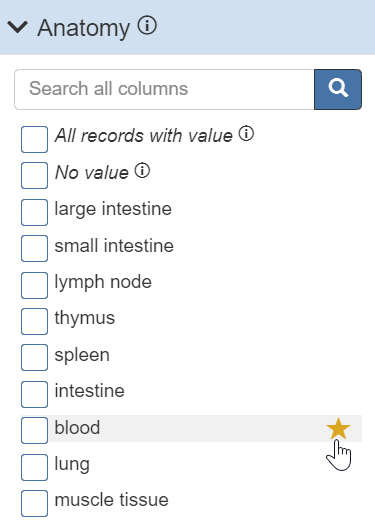
   
3. The star will turn yellow to indicate it is a favorite for all data browser searches and your dashboard will be immediately updated.

### User Help

To access additional CFDE resources, select **User Help** from the main menu bar. The following resources are available:

*   Contact the Help Desk to send an email to support@cfde.atlassian.net using your default email application.
*   Portal User Guide opens this guide.
*   Video Overviews about using CFDE tools for data integration, information on FAIR principles, and cross-cutting discovery use cases.
*   [Tutorials](https://training.nih-cfde.org/en/latest/Common-Fund-Tools/CFDE-Portal/) includes use cases and tutorials related to CFDE cohorts.
*   [Submit a Feature Request or Bug Report](https://github.com/nih-cfde/published-documentation/discussions) opens GitHub where you can select “New Discussion” to ask a question.
*   [Privacy Policy](https://docs.nih-cfde.org/en/latest/about/privacy/) includes additional information on the disclaimer of endorsement, terms and conditions, privacy policy, disclaimer of liability, and the CFDE cookie policy.
*   [About the CFDE](https://www.nih-cfde.org/) includes information such as:
    *   The [CFDE Crosscut Metadata Model (C2M2)](https://cfde-published-documentation.readthedocs-hosted.com/en/latest/spec-and-docs/C2M2-usage-guides-and-technical-documents/000-INTRODUCTION/) is a flexible standard for describing biomedical experimental data.
    *   The [FAIR Cookbook](https://cfde-published-documentation.readthedocs-hosted.com/en/latest/the-fair-cookbook/content/intro/) provides introductory materials about various aspects of FAIRness, including practical guides that show how to enhance digital objects by adhering them to communicated-accepted standards.

## Dashboard

The CFDE dashboard includes:
*   A generic dashboard of high-level charts that are available without logging in. 
*   A personalized dashboard that is available after [logging in](#login).

The CFDE dashboard displays multiple charts for users to view high-level data. The charts update automatically with the selections you make and the precise numbers can be viewed by hovering over the chart. The charts include:

*   Bar chart of the file count by Common Fund program and assay. The X-axis, Y-axis, and Stack are configurable by all users to customize the data summary as needed.
*   Bar chart of the subject count by data type and Common Fund program. The X-axis, Y-axis, and Stack are configurable by all users to customize the data summary as needed.
*   Pie chart of the number of subjects by anatomy for a single assay type across all Common Fund programs.
*   Pie chart of the number of samples by anatomy for a single Common Fund program.
*   Bar chart of the file count by data type and assay. The X-axis, Y-axis, and Stack are configurable by all users to customize the data summary as needed.

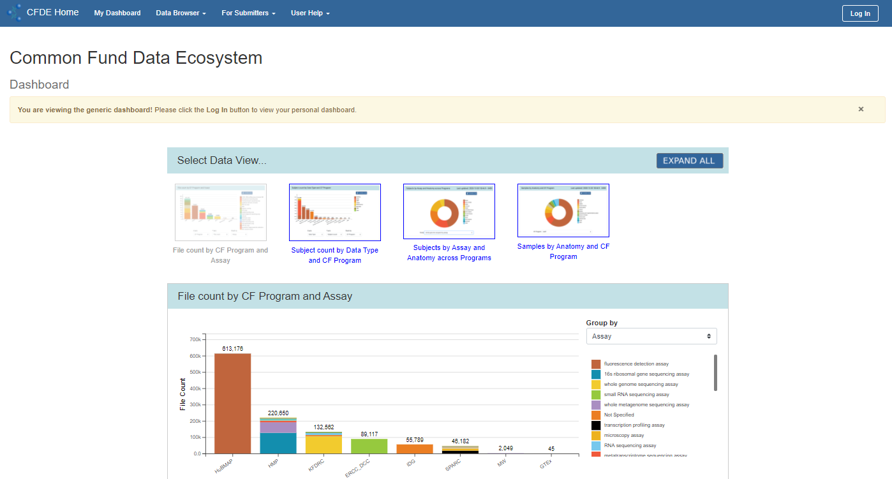

### Access the Dashboard

To access the dashboard:

*   Access the dashboard directly using this link:
[https://app.nih-cfde.org/dashboard.html](https://app.nih-cfde.org/dashboard.html)
*   Click **My Dashboard** in the main menu bar from the portal.

### Navigate the Generic Dashboard

#### Filter the Bar Charts

The bar charts allow users to compare CFDE data by CF Program, Data Type, Assay, Species, or Anatomy using File Count, Data Volume, Sample Count, or Subject Count. The X-axis, Y-axis, and Stack are configurable by all users to customize the data summaries as needed. The title of the charts update automatically to reflect the options selected.

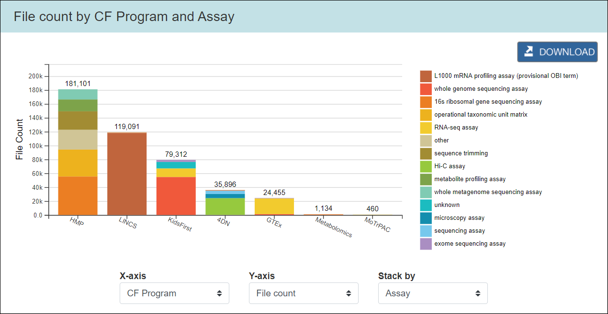

To filter the bar charts:

1. Select an **X-axis** value from the drop-down. Options include:
    - Anatomy
    - Assay
    - CF Program
    - Data Type
    - Disease
    - Ethnicity
    - Race
    - Sex
    - Species

    The horizontal axis of the bar chart updates automatically with the option selected.

2. Select a **Y-axis** value from the drop-down. Options include:
    *   Data Volume
    *   File Count
    *   Sample Count
    *   Subject Count

    The vertical axis of the bar chart updates automatically with the option selected.

3. Select a **Stack By** value from the drop-down. Options include:
    - Anatomy
    - Assay
    - CF Program
    - Data Type
    - Disease
    - Ethnicity
    - Race
    - Sex
    - Species

    The bars are stacked/sorted automatically with the option selected and the color-coded key updates with the appropriate categories.

---

NOTE: The same X-axis option cannot be selected for the Stacked By option, so the corresponding option in the Stacked By drop-down will be disabled if it is already selected in the X-axis drop-down.

---

#### Filter the Subjects by Assay and Anatomy across Programs Chart

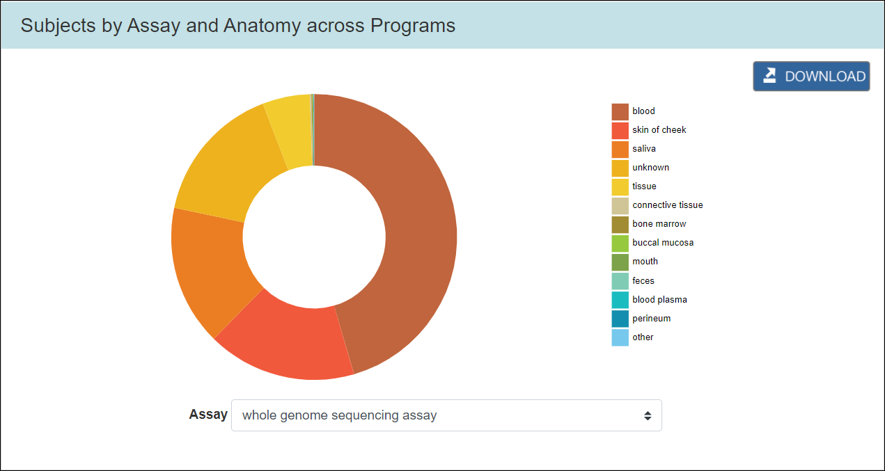

To filter the Subjects by Assay and Anatomy across Programs chart:

1. Select the **Assay Type** from the drop-down. Options include:
    *   Whole genome sequencing assay
    *   Unknown
    *   16s ribosomal gene sequencing assay
    *   RNA-seq assay
    *   Whole metagenome sequencing assay
    *   Fluorescence imaging based cell proliferation assay
    *   RNA sequencing assay
    *   Cytokine assay
    *   Exome sequencing assay
    *   Metabolite profiling assay
    *   Epigenetic modification assay
    *   Hi-C assay
    *   Lipid profiling assay
    *   Antigen specific antibodies assay
    *   Other

The pie chart updates automatically and displays the number of subjects for each anatomy category (e.g., blood plasma, saliva, tissue, etc.) across all Common Fund programs based on the assay type selected.

#### Filter the Samples by Anatomy and CF Program Chart

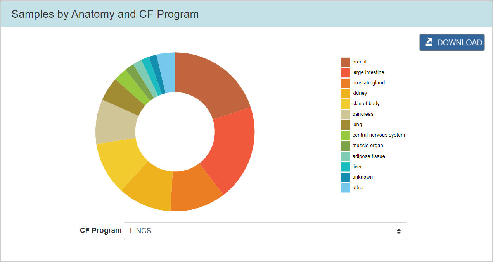

To filter the Samples by Anatomy and CF Program chart:

1. Select the **CF Program** from the drop-down. Options include:
    *   LINCS
    *   GTEx
    *   HMP
    *   Metabolomics
    *   KidsFirst
    *   4DN
    *   MoTrPAC

    The pie chart updates automatically and displays the number of samples for each anatomy category (e.g., kidney, pancreas, lung, etc.) based on the Common Fund program selected.

#### Download the Chart

The Download icon () displays next to each chart to download the data as a PNG, SVG, or CSV file. The PNG and SVG exports are image files of the chart, whereas the CSV export is a spreadsheet of the data.

### Navigate the Personalized Dashboard
After [logging in](#login), you can view your personalized dashboard that includes saved searches and saved favorites for CF Programs, Anatomy, Assay, Disease, Taxonomy, Data Type, File Format, Gene, and Compound facets. 

To populate the personalized dashboard:
* Saved searches – Browse data under the Data Browser menu and select **Saved Searches > Save current search criteria** from the upper-right of the page. See the [Save Searches](#save-searches) section for more information. 
* Personal Collections - Browse files under the Data Browser menu and select **Add Record** under the Part of Personal Collection section. See the [View and Create Your Personal Collections](#view-and-create-your-personal-collections) section for more information.
* Favorites – Browse data under the Data Browser menu and select the star icon next to an item in the Refine Search filter panel facet. See the [Add Favorites](#add-favorites) section for more information.

The bar chart can be filtered by DCC (the checkboxes on the right) and grouped by anatomy, assay, CF program, data type, disease, ethnicity, race, sex, or species (the Group By drop-down at the top). You can also change the y-axis and/or the x-axis to view the appropriate information.

Below this bar chart are additional charts for [Subjects by Assay and Anatomy across Programs](#Filter-the-Subjects-by-Assay-and-Anatomy-across-Programs-Chart) and [Samples by Anatomy and CF Program](#Samples-by-Anatomy-and-CF-Program-Chart).

## Data Review
The Data Review page displays the recent data submission that has not yet been incorporated into the main catalog. Data administrators should review the data to ensure it is correct before being incorporated into the portal. The DCC data that displays is based on the DCC associated with your login account.

To access the Data Review page, click Data Review in the main menu bar from the portal or dashboard.

The data review options under the Submission System menu bar include:

* Submitted Datapackages
* Enrolled DCCs
* Enrolled Groups
* Releases
* Vocabulary

### Review Submitted Datapackages
To review the submitted datapackages:

1. Select one of the following options:
    * The **Data Review** option in the main menu bar from the portal or dashboard.
    * The **Submission System > Submitted Datapackages** option in the main menu bar of the Data Review system.

    The Submitted Datapackage page displays.

2. The data browser includes the following columns in the results table:
    * View
        * Click the View icon next to the appropriate record to view more information about the record. See the [View Details](#view-details) section for more information.
        * For users with Approver permissions, an Edit (pencil) icon will display in this column as well. See the [Approve Data](#approve-data) section for more information.
    * Submission – Displays additional identifying information about the submitted data, such as submission date, ID, the DCC, and the submitter.
    * Status Summary – The ingest status (what is happening with your submission) and approval status of the datapackage in the submission system. When the ingest status is “content ready for review,” additional links for Browse Data, Summary Charts, and Raw Data display where you can review the submission. See the [Review Content](#review-content) section for more information.
3. The results can be filtered using the Refine Search filter panel. See the [Refine Search Results](#refine-search-results) section for more information. The panel includes the following facets by which you can filter the results:
    * Submitting DCC
    * Submitting User
    * Status
    * DCC Approval
    * CFDE Approval
    * Submission Time

### Review Content
On the Submitted Datapackages page, you can access additional information about a record in the “content ready for review” ingest status by selecting one of the following links in the Review Content section (under the Status Summary column):

* Browse Data – The [File data browser](#browse-by-file) displays with additional information for that record only. You can view additional details about the submission by selecting **In-Review Submission > Submission <ID>**.

  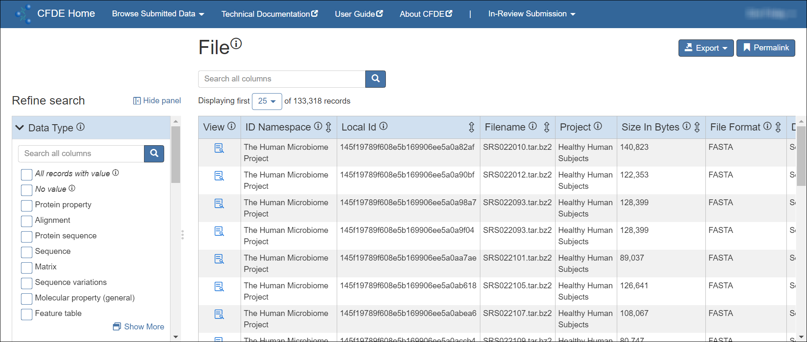

* Summary Charts – The [dashboard](#dashboard) displays with additional information for that record only. The hyperlinked totals will open [data browsers](#explore-the-repository) with additional information about those numbers. You can also access this page from the Browse Data File data browser by selecting **In-Review Submission > Content Summary Charts** from the main menu.

 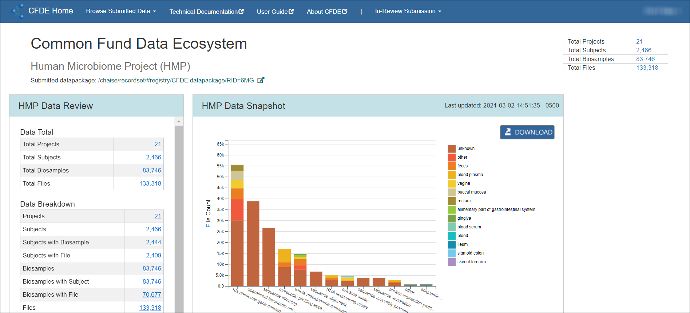

* Raw Data – Provides a download of the BDBag that was created when cfde-submit run was ran, so you can always retrieve a copy of your input data.

### Review Enrolled DCCs
To review the enrolled/onboarded DCCs:

1. Select the **Submission System > Enrolled DCCs** option in the main menu bar of the Data Review system. The Onboarded DCC page displays.

    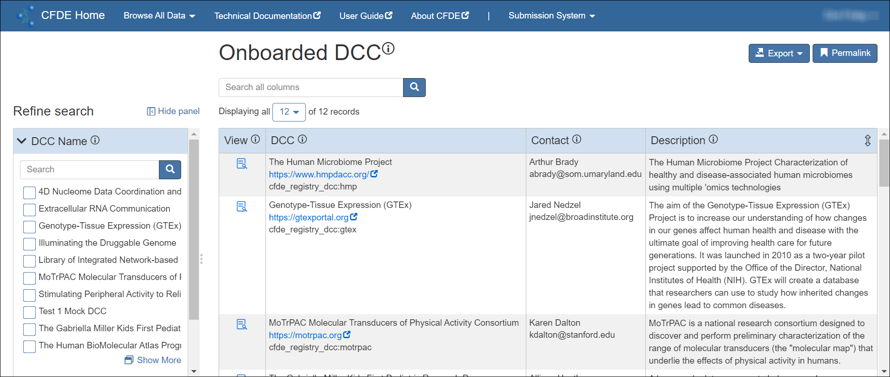

2. The data browser includes the following columns in the results table:
    * View – Click the icon next to the appropriate record to view more information about the record. See the [View Details](#view-details) section for more information.
    * DCC – The name of the DCC enrolled/onboarded with the CFDE-CC.
    * Contact – The primary contact’s name and email of the DCC.
    * Description – A long description of the DCC’s purpose and data researched.
3. The results can be filtered using the Refine Search filter panel. See the [Refine Search Results](#refine-search-results) section for more information. The panel includes the following facets by which you can filter the results:
    * DCC Name
    * Contact Name
    * Contact Email

### Review Enrolled Groups
To review the enrolled/registered groups:

1. Select the **Submission System > Enrolled Groups** option in the main menu bar of the Data Review system. The Registered Group page displays.

    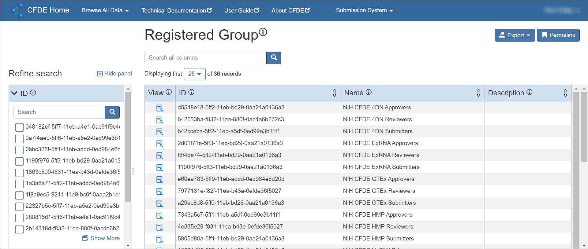

2. The data browser includes the following columns in the results table:
    * View – Click the icon next to the appropriate record to view more information about the record. See the [View Details](#view-details) section for more information.
    * ID – The globally unique identifier for the group.
    * Name – A short label for the enrolled/registered group.
    * Description – A long description of the group.
3. The results can be filtered using the Refine Search filter panel. See the [Refine Search Results](#refine-search-results) section for more information. The panel includes the following facets by which you can filter the results:
    * ID
    * Name
    * Description
    * DCC Group Role

### Review Releases
To review the CFDE releases:

1. Select the **Submission System > Releases** option in the main menu bar of the Data Review system. The CFDE Release page displays.

     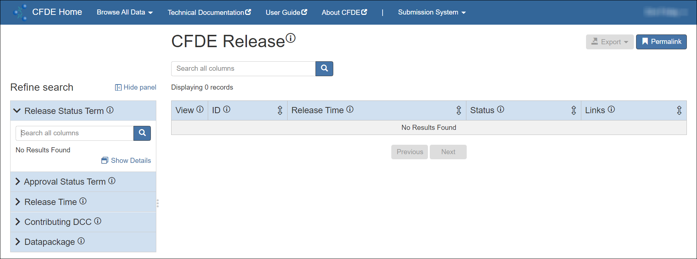

2. The data browser includes the following columns in the results table:
    * View – Click the icon next to the appropriate record to view more information about the record. See the [View Details](#view-details) section for more information.
    * ID – The identifier for this release issued by the CFDE-CC for internal use.
    * Release Time – A timestamp for when the release was completed by the CFDE-CC.
    * Status – The status of this release in the submission system.
    * Links – The URL of the ERMrest (an entity-relationship data storage service) catalog with the release content.
3. The results can be filtered using the Refine Search filter panel. See the [Refine Search Results](#refine-search-results) section for more information. The panel includes the following facets by which you can filter the results:
    * Release Status Term
    * Approval Status Term
    * Release Time
    * Contributing DCC
    * Datapackage

### Review Vocabulary
To review the vocabulary:

1. Select the **Submission System > Vocabulary** option in the main menu bar of the Data Review system.
2. Select an item from the list:
    * Release Status
    * Datapackage Status
    * Table Status
    * Approval Status
    * Group Role  
The data browser displays the CFDE data and filters related to the vocabulary term.
3. The data browser includes the following columns in the results table:
    * View – Click the icon next to the appropriate record to view more information about the record. See the [View Details](#view-details) section for more information.
    * ID – The globally unique identifier for the status concept.
    * Name – A short label for the status concept.
    * Description – A long description of the status concept.
4. The available filters in the Refine Search panel vary based on the vocabulary term selected. See the [Refine Search Results](#refine-search-results) section for more information on how to filter the results.

### Approve Data
Data can only be approved (or rejected) by users with Approver permissions.

To approve submitted data:

After [logging in](#login), you can view your personalized dashboard that includes saved searches and saved favorites for CF Programs, Anatomy, Assay, Disease, Taxonomy, Data Type, and File Format facets.

To populate the personalized dashboard:
*   Saved searches – Browse data under the Data Browser menu and select **Saved Searches > Save current search criteria** from the upper-right of the page. See the [Save Searches](#save-searches) section for more information. 
*   Favorites – Browse data under the Data Browser menu and select the star icon next to an item in the Refine Search filter panel facet. See the [Add Favorites](#add-favorites) section for more information.

The chart at the bottom of the personalized dashboard can be filtered by DCC (the checkboxes on the right) and grouped by anatomy, assay, CF program, data type, species, or disease (the Group By drop-down at the top). You can also change the y-axis and/or the x-axis to view the appropriate information.

## Data Submission
The Data Submission section is for data administrators to submit, review, and approve the data before being incorporated into the portal. This requires advanced permissions and is therefore not discussed in this User Guide. Please see the [CFDE wiki](https://github.com/nih-cfde/published-documentation/wiki) for more information on how to submit, review, and approve data.
